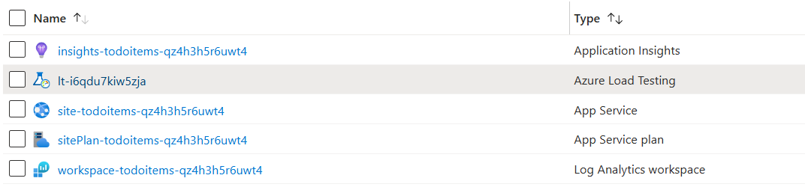

[comment]: <> (please keep all comment items at the top of the markdown file)
[comment]: <> (please do not change the ***, as well as 
 placeholders for Note and Tip layout)
[comment]: <> (please keep the ### 1. and 2. titles as is for consistency across all demoguides)
[comment]: <> (section 1 provides a bullet list of resources + clarifying screenshots of the key resources details)
[comment]: <> (section 2 provides summarized step-by-step instructions on what to demo)

[comment]: <> (this is the section for the Note: item; please do not make any changes here)
***
### Azure Load Testing - demo scenario

**Note:** Below demo steps should be used **as a guideline** for doing your own demos. Please consider contributing to add additional demo steps.

***
### 1. What Resources are getting deployed
This scenario deploys the sample **TodoItems .NET** application inside a **Azure App Service**. When deployed, the following resources are available:

* site-todoitems-%uniqueid% - Azure App Service
* sitePlan-todoitems-%uniqueid% - Azure Service Plan
* insights-todoitems-%uniqueid% - Azure Application Insights
* workspace-todoitems-%uniqueid% - Azure Log Analytics Workspace
* lt-%uniqueid% - Azure Load Test

  

### 2. What can I demo from this scenario after deployment
Explain the following concepts:
- Load Testing
- After running Load Test: create queries with KQL
- After running Load Test: create a Workbook

[comment]: <> (this is the closing section of the demo steps. Please do not change anything here to keep the layout consistant with the other demoguides.)
  
***

**Note:** This is the end of the current demo guide instructions.

